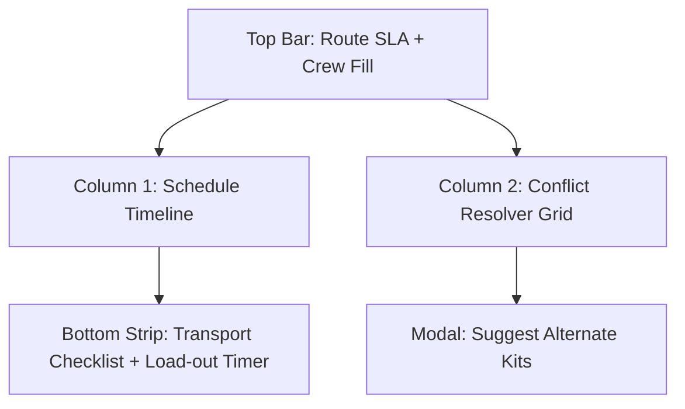
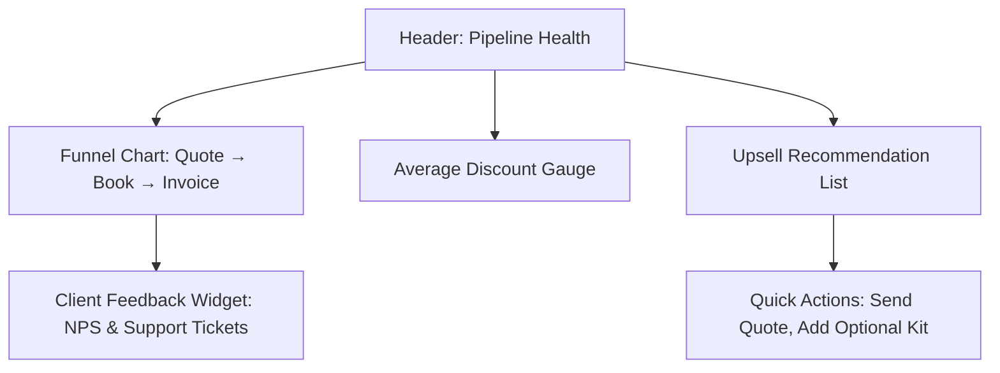
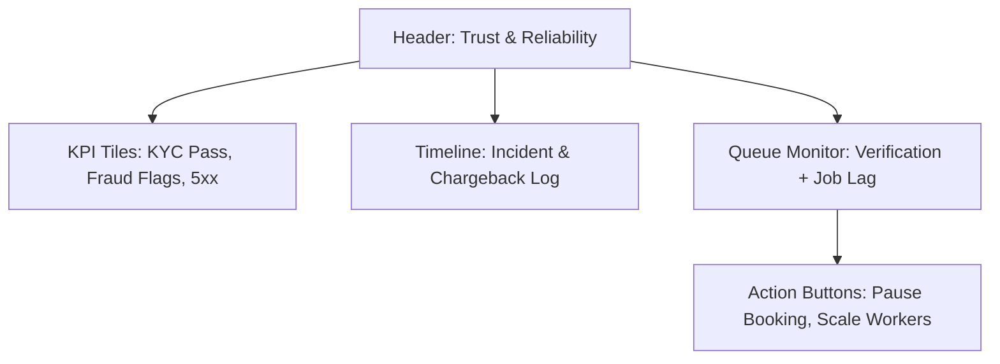

# Dashboards & KPI Mapping

## Persona KPI Matrix
| Persona | KPI | Data Source | Dashboard Module | Notes |
| --- | --- | --- | --- | --- |
| CFO / Finance | Asset-day utilization % | Planner jobs + inventory availability | Utilization heatmap | Highlight underused assets per week.
| CFO / Finance | Gross margin % | Quote line items + cost rates | Margin waterfall | Drill-down by kit.
| CFO / Finance | DSO | Invoice issue vs. payment dates | Collections tracker | Aging buckets with alerts.
| CFO / Finance | Deposit capture rate | Billing transactions | Payment funnel | Show pending deposits.
| CFO / Finance | Late-return cost | Scanner return logs | Exceptions board | Add auto-penalty calculator.
| Planner / Ops | On-time delivery % | Transport dispatch logs | Route timeline | Flag late departures.
| Planner / Ops | Crew fill rate | Crew assignments vs. required | Roster board | Heatmap of gaps.
| Planner / Ops | Scheduling conflicts | Inventory reservations | Conflict resolver | CTA to swap gear.
| Planner / Ops | Route efficiency proxy | Distance matrix + jobs | Fleet map | Optimize multi-drop.
| Warehouse | Pick accuracy % | Scanner scans vs. manifest | Picking dashboard | Alert on mismatches.
| Warehouse | Prep time/order | Pick start/end timestamps | Prep timer table | SLA countdown.
| Warehouse | Kit completeness % | Discrepancy logs | QC checklist | Pre-departure sign-off.
| Warehouse | Scan throughput | Scanner events/minute | Live monitor | Offline indicator.
| Sales / BD | Quote-to-book % | Quote + contract status | Pipeline chart | Stage conversion.
| Sales / BD | Avg. discount | Pricing vs. list | Discount monitor | Guardrail thresholds.
| Sales / BD | Upsell attach rate | Optional kit acceptance | Deal insights | Suggestions for add-ons.
| Support | Ticket SLA % | Ticket timestamps | SLA tracker | Warn before breach.
| Support | NPS | Survey responses | Sentiment panel | Trend vs. baseline.
| Support | First-contact resolution % | Ticket reopen events | Resolution table | Identify training needs.
| Security / KYC | KYC pass rate | Provider webhooks | Verification queue | Auto reminders.
| Security / KYC | Fraud-flag rate | Risk engine scores | Fraud radar | Show reason codes.
| Security / KYC | Chargeback rate | Payment disputes | Chargeback ledger | Tag by client.
| DevOps | 5xx per route | API gateway logs | Error budget widget | Link to runbooks.
| DevOps | p95 latency | APM traces | Latency sparkline | Compare to SLO.
| DevOps | Uptime SLO | Monitoring uptime checks | Availability scorecard | Show burn rate.
| DevOps | Job processor lag | Queue depth metrics | Worker dashboard | Backlog trend.

## Dashboard Wireframes

### 1. Executive Utilization Cockpit (CFO + Planner)
```mermaid
graph TD
  A[Header: Utilization & Margin] --> B[Row 1: Asset Utilization Heatmap]
  A --> C[Row 2: Margin Waterfall + Cost Drivers]
  C --> D[Right Rail: Alerts (Late Returns, Overdue Deposits)]
  B --> E[Drilldown Modal: Asset Detail Timeline]
```

### 2. Operations Control Tower (Planner + Warehouse)


### 3. Revenue Engine Dashboard (Sales + Support)


### 4. Compliance & Reliability Board (Security + DevOps)


## Implementation Notes
- Use feature flags to expose persona-specific dashboard tabs from Planner presets (`personaPresets` in `Planner.jsx`).
- Persist filter selections via API instead of `localStorage` only (extend `App.jsx` session logic).
- Compose dashboards using Next.js dynamic routes with cached Prisma queries for KPIs.
- Add Playwright smoke checks for KPI widgets to detect regressions once implemented.
