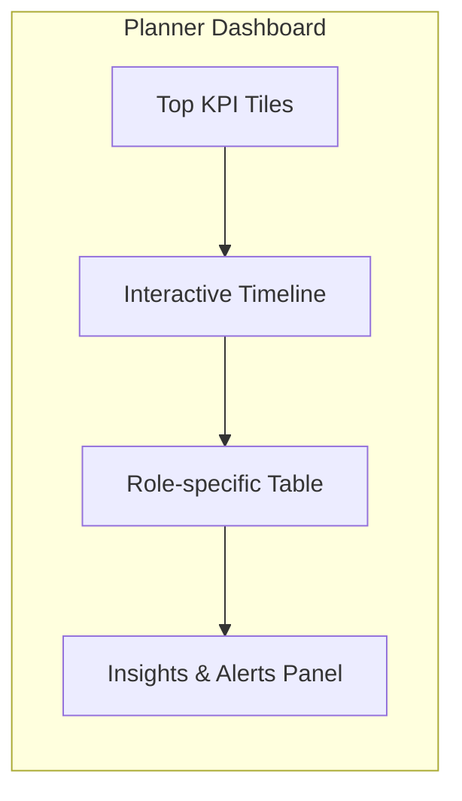

# Dashboard Review

## Huidige status
- **Planner.jsx** fungeert als centrale cockpit met persona presets, maar alle presets verwijzen naar fictieve namen i.p.v. zakelijke rollen.【F:Planner.jsx†L5-L101】
- Dashboard toont events met status/risk badges, maar ontbreekt KPI-kaarten, export opties en lege staten.【F:Planner.jsx†L162-L200】
- Geen loading/error states wanneer API faalt; UI vertrouwt op impliciete data uit backend.【F:Planner.jsx†L1-L200】

## Persona alignment
| Persona | KPI behoefte | Huidige dekking | Aanpassingen |
| --- | --- | --- | --- |
| CFO | Cashflow, DSO, marge | Geen finance widgets | Voeg revenue/forecast grafieken toe en gebruik preset "Finance" met filtering op afgeronde projecten.【F:OnboardingOverlay.jsx†L38-L45】 |
| Compliance | SLA, audit status | Geen | Voeg tabel met compliance status en document upload-progress toe.【F:Planner.jsx†L5-L101】 |
| Analyst | Throughput, queue, forecast | Geen queue metrics | Introduceer line chart + backlog teller en drill-down links.【F:Planner.jsx†L162-L183】 |
| System Admin | Incidenten, uptime, integraties | Geen | Toon health widgets en integratie status, plus log export CTA.【F:OnboardingOverlay.jsx†L201-L237】 |
| Sales | Pipeline, winrate | Geen | Voeg funnel widget + stage conversie grafiek toe.【F:onboarding_tips.json†L1-L32】 |
| Support | SLA, backlog, CSAT | Geen | Voeg SLA burn-down en ticket backlog grafiek toe.【F:Planner.jsx†L162-L183】 |
| Partner | Leverstatus, voorraad | Geen | Toon sharebare timeline met status filter en export knop.【F:Planner.jsx†L5-L200】 |
| Klant | Projectstatus, opleverdatum | Geen | Toon timeline + milestone status met downloadbare rapportage.【F:Planner.jsx†L162-L200】 |
| DevOps | Deployments, fouten | Geen | Voeg widgets voor build status en API latentie toe.【F:api.js†L10-L43】 |
| Auditor | Audit logs, controls | Geen | Voeg compliance heatmap en exportknop toe.【F:Planner.jsx†L5-L200】 |

## Drill-down & navigatie
- Geen knoppen/links in Planner cards om naar detailpagina’s te gaan; cards renderen inline tekst zonder CTA.【F:Planner.jsx†L191-L200】
- Onboarding overlay "Markeer gereed" triggert API zonder validatie dat dashboard data aanwezig is.【F:OnboardingOverlay.jsx†L222-L233】

## Empty/Loading/Error states
- Geen skeleton of lege-state messaging; user ziet blanco pagina bij 0 events.【F:Planner.jsx†L5-L200】
- Onboarding overlay toont generieke fallback bij errors, zonder referentie naar dashboard impact.【F:OnboardingOverlay.jsx†L149-L173】

## Aanbevolen layout wijziging (schets)

## Prioriteiten
1. Persona-based preset JSON + dynamic rendering.
2. KPI kaarten met drill-down (link naar detail route of modal).
3. Empty/loading states + export/share knoppen.
4. Error banner gekoppeld aan onboarding status.

