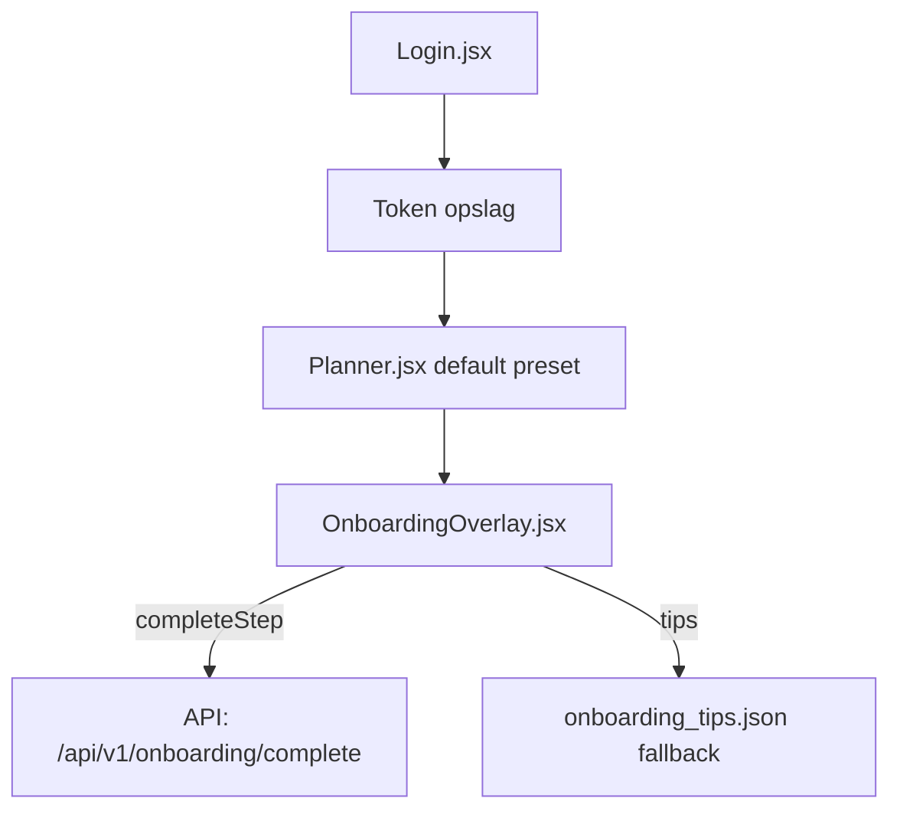

# Onboarding Audit — Analyst / Operator

**Friction score:** 3 / 5  
**Estimated time-to-value:** 1-2 dagen (vereist eigen datafeed)

## Flow details
| Stap | Component | API | Opmerkingen |
| --- | --- | --- | --- |
| Authenticatie | `<Login>` | `/api/v1/auth/login` | Demo accounts werken, maar geen operator rol of uitleg over datasets.【F:Login.jsx†L6-L137】 |
| Dashboard toegang | `<Planner>` | Onbekend | Geen dataset import instructie; operator moet raden welke preset relevant is.【F:Planner.jsx†L5-L101】 |
| Checklist | `<OnboardingOverlay>` | `/api/v1/onboarding/*` | Stappen beschrijven modules, maar geen data seed of progress indicator per dataset.【F:OnboardingOverlay.jsx†L6-L173】 |
| Tips | `onboarding_tips.json` | lokale fallback | Tips verwijzen naar MR-DJ features, geen operator metrics (queue length, SLA).【F:onboarding_tips.json†L1-L32】 |

## Fricties
1. **Geen dataset import** – Operator kan geen minimale dataset uploaden, dus dashboards blijven leeg.【F:OnboardingOverlay.jsx†L6-L47】
2. **Geen realtime feedback** – `refreshProgress` haalt data op maar UI toont enkel percentage zonder detail.【F:OnboardingOverlay.jsx†L201-L237】
3. **Onbekende KPI’s** – Planner toont geen queue/throughput metrics.【F:Planner.jsx†L5-L200】

## Aanbevolen verbeteringen
- Voeg stap "Importeer sample dataset" met progress UI en error handling.
  - *Acceptatie*: Operator kan CSV uploaden en ziet status + retry mogelijkheid.【F:OnboardingOverlay.jsx†L245-L374】
- Breid Planner uit met operator preset (SLA, queue) en lege-state copy.
  - *Acceptatie*: Preset toont KPI kaarten met placeholder data + instructies.【F:Planner.jsx†L5-L200】
- Toon detailstatus in onboarding overlay (bijv. per module progress, logs).
  - *Acceptatie*: `refreshProgress` toont spinner + foutmelding bij mislukking.【F:OnboardingOverlay.jsx†L201-L237】

## Risico
- **Data quality**: Middel – zonder guidance kans op foutieve imports.
- **Adoptie**: Middel – operator moet extra documentatie zoeken.

