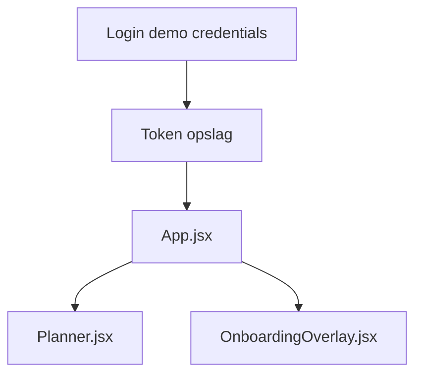

# Onboarding Audit — Auditor

**Friction score:** 5 / 5  
**Estimated time-to-value:** Geblokkeerd (geen audit trail)

## Flow mapping
| Stap | Component | Bevinding |
| --- | --- | --- |
| Authenticatie | `<Login>` | Geen MFA of audit logging; demo wachtwoorden vast in code.【F:Login.jsx†L6-L37】 |
| Session | `api.js` | Geen token expiratie; geen logging bij 401 behalve reload.【F:api.js†L14-L43】 |
| Dashboard | `<Planner>` | Geen audit weergaven, geen exportfunctionaliteit.【F:Planner.jsx†L5-L200】 |
| Onboarding | `<OnboardingOverlay>` | Checklist bevat geen audit stap, geen download logs of compliance checklists.【F:OnboardingOverlay.jsx†L6-L173】 |

## Blokkades
1. **Geen audit trail** – Nergens mogelijkheid tot log export of event history.【F:OnboardingOverlay.jsx†L6-L173】
2. **Geen beveiliging** – Login mist MFA/SSO; tokens persistent in localStorage.【F:Login.jsx†L6-L37】【F:api.js†L14-L43】
3. **Geen statusrapport** – Planner toont geen compliance KPI’s of evidence status.【F:Planner.jsx†L5-L200】

## Fixes & acceptatiecriteria
- Voeg audit stap toe met downloadbare logbestanden en statusindicator.
  - *Acceptatie*: Auditor kan log export starten vanuit overlay; stap markeert voltooid na download.【F:OnboardingOverlay.jsx†L245-L374】
- Introduceer MFA en login auditing (last login, IP) voor demo accounts.
  - *Acceptatie*: Login scherm toont MFA prompt/indicator voor audit gebruikers.【F:Login.jsx†L6-L37】
- Bouw compliance dashboard preset met checklists en SLA weergave.
  - *Acceptatie*: Planner toont "Audit" preset met statuses en exportknop.【F:Planner.jsx†L5-L200】

## Risico
- **Regulatory**: Kritiek – zonder audit trail geen certificering.
- **Security**: Hoog – tokens en credentials zwak beveiligd.

