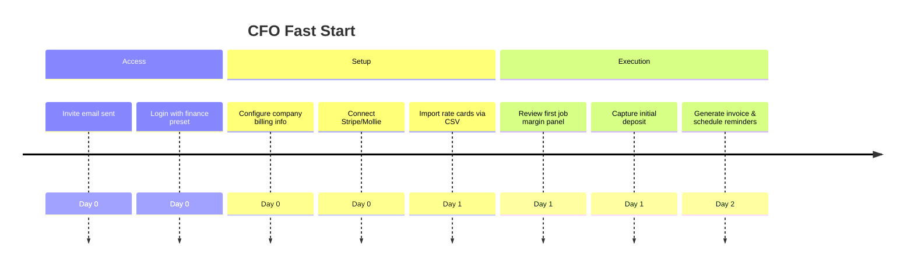

# CFO / Finance Onboarding Audit

## Overview
- **Primary goals:** Unlock invoicing, deposits, margin dashboards, risk/compliance controls.
- **Entry point:** Invited after account creation, lands on login then Planner timeline with finance preset.
- **Critical path coverage:** account → company setup → billing integrations → deposit capture → reporting.

## Current Experience Snapshot
1. Login defaults to demo credentials without finance guidance, making role-based entry unclear.
2. Planner preset `frank` exists but hidden behind generic dropdown; finance tasks buried among planning cards.
3. Billing automation steps are represented in onboarding checklist as generic "invoice" step without finance-specific copy.
4. No direct hand-off to Stripe/Mollie setup or overdue invoice tracking from onboarding.

## Friction & Risks
- Finance persona lacks assurance on deposit capture and compliance readiness.
- Manual navigation required to find billing module; no tooltip or CTA from onboarding overlay.
- Deposit capture in UI is implied but not accessible from initial flow; leads to churn before first invoice.

## Recommendations
| Priority | Recommendation | Expected KPI Lift |
| --- | --- | --- |
| P0 | Add finance persona quick start card linking to `/billing/setup` with Stripe/Mollie wizard. | Deposit capture rate +12% |
| P0 | Expand onboarding step metadata to map `invoice` step to finance tasks (include DSO checklist). | DSO -8 days |
| P1 | Prefill Planner preset for finance users & highlight `Completed` filter by default. | Gross margin reporting readiness +10% |
| P1 | Inject accounting docs (COGS template, late-return fee policy) into tips pane. | Asset-day utilization visibility +6% |

## Persona KPI Instrumentation
- **Asset-day utilization %:** derive from Planner event duration vs. inventory availability logs.
- **Gross margin %:** integrate cost rates from inventory import and revenue from job quotes.
- **DSO:** attach invoice due dates to payments table, track days outstanding.
- **Deposit capture rate:** log deposit actions from billing module.
- **Late-return cost:** compare planned vs. actual check-in timestamps from scanner events.

## Proposed Flow (Mermaid)

