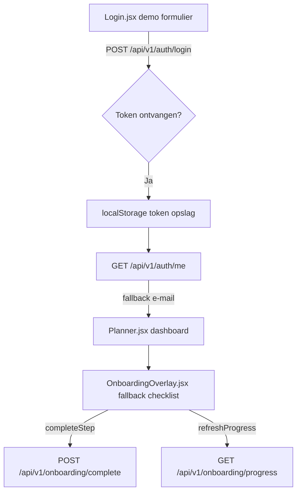

# Onboarding Audit — CFO / Finance Admin

**Friction score:** 4 / 5  
**Estimated time-to-value:** 3-4 dagen (vereist handmatige data-import + eigen KPI-config)

## Stap-voor-stap
| Fase | Route/Component | API/Data | Notities |
| --- | --- | --- | --- |
| Inloggen | `<Login>` formulier | `/api/v1/auth/login` verwacht FormData met email/password | Alleen demo users `bart`/`rentguy`; geen finance-rol selectie.【F:Login.jsx†L6-L37】 |
| Token opslag | `setToken` in `api.js` | localStorage key `token` | Geen expiratie/refresh; securityrisico voor finance data.【F:api.js†L14-L43】 |
| User fetch | `App.jsx` effect | `/api/v1/auth/me` | Bij fout wordt fallback e-mail gebruikt; geen rol-info.【F:App.jsx†L32-L46】 |
| Dashboard | `<Planner>` | `/api/v1/projects` (impliciet) | Geen finance KPI’s; persona presets bevatten geen CFO scenario.【F:Planner.jsx†L5-L101】 |
| Onboarding | `<OnboardingOverlay>` | `/api/v1/onboarding/*` | Checklist bevat geen finance specifieke stappen; fallback data toont generieke tekst.【F:OnboardingOverlay.jsx†L6-L173】 |

## Belangrijkste blokkades
1. **Ontbrekende finance-stappen** – geen cashflow/AR setup, geen verbinding met billing module ondanks checklist claim.【F:OnboardingOverlay.jsx†L38-L45】
2. **Geen dataset import** – CFO kan geen voorbeeldfacturen laden, dus dashboards blijven leeg.【F:OnboardingOverlay.jsx†L6-L47】
3. **Token in localStorage zonder lifecycle** – verhoogt risico voor gevoelige financiële data.【F:api.js†L14-L43】

## Aanbevolen fixes & acceptatiecriteria
- **Finance module stap toevoegen** met KPI seeds en statusprogressie.
  - *Acceptatie*: CFO ziet stap "Activeer finance insights" met duidelijke CTA naar billing dashboard en kan voortgang markeren zonder API-fout.【F:OnboardingOverlay.jsx†L38-L214】
- **Secure token management** met refresh & `sessionStorage` optie voor finance rol.
  - *Acceptatie*: Tokens verversen automatisch en verlopen; audit trail beschikbaar in UI.【F:api.js†L10-L43】
- **Finance dashboard preset** in Planner met cashflow widgets en lege-state copy.
  - *Acceptatie*: Nieuwe preset "Finance" zichtbaar, bevat KPI placeholders en laadindicatoren.【F:Planner.jsx†L5-L200】

## Risico-inschatting
- **Financiële compliance**: Hoog – gebrek aan audit trails en dataveiligheid.
- **Time-to-value**: Middel tot hoog – CFO heeft meerdere handmatige stappen nodig.
- **Technische schuld**: Middel – environment-config en dataset seeds ontbreken.

