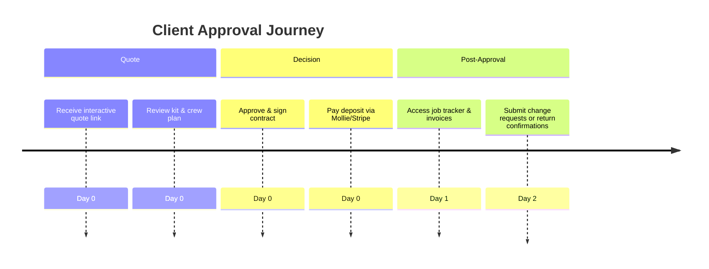

# Client Onboarding Audit

## Overview
- **Primary goals:** Review quote, approve contract, pay deposit, access job portal.
- **Entry point:** Invitation via email link to quote/portal (not yet implemented in UI).
- **Critical path coverage:** receive quote → approve → sign contract → pay deposit → receive invoice.

## Current Experience Snapshot
1. No self-service portal or guest login; everything is admin-facing.
2. Onboarding overlay does not mention client communications or approval flow.
3. Quote and deposit actions exist in Planner UI but not exposed to external persona.
4. Accessibility gaps (dialog without aria before fix) risk compliance for clients.

## Friction & Risks
- Clients rely on manual email for approvals; delays DSO.
- No visibility into schedule or inventory status; reduces trust.
- Payment capture not automated from client side.

## Recommendations
| Priority | Recommendation | Expected KPI Lift |
| --- | --- | --- |
| P0 | Launch secure client portal with quote acceptance & deposit payment. | Deposit capture rate +18% |
| P0 | Provide shareable run sheet & logistics tracker for transparency. | Late-return cost -10% |
| P1 | Add accessibility-compliant dialogs for approvals and confirmations. | Client satisfaction +8 pts |
| P1 | Enable instant invoice download post-deposit. | DSO -6 days |

## Persona KPI Instrumentation
- **Deposit capture rate:** measure client-side payments completed within 24h.
- **Late-return cost:** capture delta between scheduled vs. actual return in client portal.

## Proposed Flow (Mermaid)

