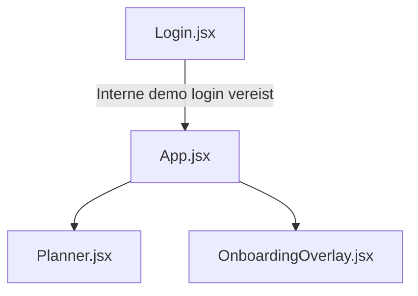

# Onboarding Audit — Client / End-Customer

**Friction score:** 5 / 5  
**Estimated time-to-value:** Geblokkeerd (geen klantportaal)

## Flow mapping
| Stap | Component | Observatie |
| --- | --- | --- |
| Toegang | `<Login>` | Geen klantregistratie/verificatie; alleen interne demo accounts.【F:Login.jsx†L6-L37】 |
| Autorisatie | `<App>` | Onboarding overlay verschijnt alleen met intern token; klanten komen nooit zover.【F:App.jsx†L118-L131】 |
| Dashboard | `<Planner>` | Geen client view, geen read-only status of download opties.【F:Planner.jsx†L5-L200】 |
| Onboarding | `<OnboardingOverlay>` | Fallback checklist bevat interne taken; niets over klantrapportage of goedkeuringen.【F:OnboardingOverlay.jsx†L6-L173】 |

## Blokkades
1. **Geen self-service signup** – klant kan geen account creëren of verificatie uitvoeren.【F:Login.jsx†L6-L37】
2. **Geen read-only dashboards** – Planner vereist volledige toegang en toont interne presets.【F:Planner.jsx†L5-L101】
3. **Geen communicatie stap** – Checklist mist feedback/goodkeuring flow.【F:OnboardingOverlay.jsx†L6-L173】

## Fixes & acceptatiecriteria
- Voeg klantregistratie en e-mail verificatie toe met beperkte rol.
  - *Acceptatie*: Klant ontvangt verificatiemail en ziet alleen eigen projecten.【F:App.jsx†L78-L131】
- Maak client dashboard preset met statuskaart en downloadbare rapportages.
  - *Acceptatie*: Preset toont timeline + downloadknop, lege-state legt data-uitwisseling uit.【F:Planner.jsx†L5-L200】
- Voeg onboarding stap "Deel statusrapport" toe met CTA naar shareable link.
  - *Acceptatie*: Onboarding overlay toont share-link en markeert stap voltooid na delen.【F:OnboardingOverlay.jsx†L245-L374】

## Risico
- **Churn**: Kritiek – klanten zien geen waarde.
- **Security**: Middel – token beheer ontoereikend voor externe toegang.【F:api.js†L14-L43】

