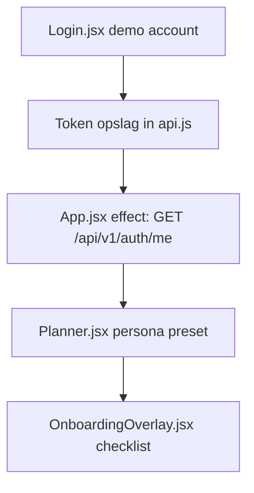

# Onboarding Audit — Compliance / PSRA Manager

**Friction score:** 5 / 5  
**Estimated time-to-value:** Geblokkeerd zonder maatwerk (geen compliance flows)

## Stap-voor-stap analyse
| Fase | Component | API/Data | Observaties |
| --- | --- | --- | --- |
| Inloggen | `<Login>` | `/api/v1/auth/login` | Geen mogelijkheid om compliance rol te selecteren of MFA te verplichten.【F:Login.jsx†L6-L37】 |
| Dashboard | `<Planner>` | Onbekende endpoint (verwacht `/api/v1/projects`) | Persona presets richten zich op entertainment profielen, geen PSRA of compliance dashboards.【F:Planner.jsx†L5-L101】 |
| Onboarding | `<OnboardingOverlay>` | `/api/v1/onboarding/*` | Checklist mist controles voor vergunningen, veiligheidsdocumenten of audit logging.【F:OnboardingOverlay.jsx†L6-L173】 |

## Blokkades
1. **Geen PSRA preset** – compliance manager kan geen relevante filters toepassen.【F:Planner.jsx†L5-L101】
2. **Geen document upload/verificatie** – onboarding bevat enkel generieke stappen; geen validatie van veiligheidsdocumenten.【F:OnboardingOverlay.jsx†L6-L173】
3. **Fallback verbergt API-fouten** – compliance kan niet vertrouwen op status; overlay toont altijd "standaard onboarding" melding.【F:OnboardingOverlay.jsx†L149-L173】

## Fixes & acceptatiecriteria
- **PSRA preset in Planner** met kolommen voor vergunningstatus en SLA.
  - *Acceptatie*: Nieuwe preset "Compliance/PSRA" zichtbaar met lege-state uitleg.【F:Planner.jsx†L5-L200】
- **Onboarding step "Upload veiligheidsdossier"** inclusief progress indicator.
  - *Acceptatie*: Stap blokkeert afronding totdat upload geslaagd en audit trail gelogd.【F:OnboardingOverlay.jsx†L245-L374】
- **Expose API errors** met retry/backoff zodat compliance weet wanneer gegevens ontbreken.
  - *Acceptatie*: Bij 5xx toont overlay rood alert met support CTA i.p.v. fallback tekst.【F:OnboardingOverlay.jsx†L149-L237】

## Risico
- **Regulatory risk**: Kritiek – geen bewijs van PSRA-compliance.
- **Operational risk**: Hoog – teams kunnen per ongeluk live gaan zonder checks.
- **Security risk**: Middel – tokens in localStorage zonder scope controle.【F:api.js†L14-L43】

