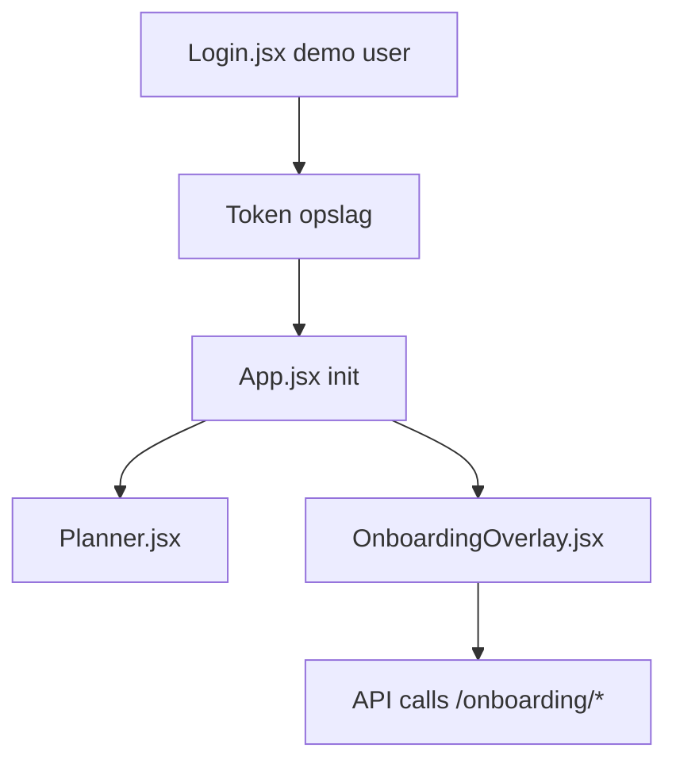

# Onboarding Audit — Developer / DevOps

**Friction score:** 3 / 5  
**Estimated time-to-value:** ~1 dag (manuele setup + debugging)

## Flow mapping
| Stap | Component | Bevinding |
| --- | --- | --- |
| Auth | `<Login>` | Geen dev-mode toggle; geen informatie over API keys of env variables.【F:Login.jsx†L6-L137】 |
| Config | `api.js` | Base URL hardcoded; geen `.env` of mocking voor lokale ontwikkeling.【F:api.js†L10-L43】 |
| State | `<App>` | Onboarding startcondities in localStorage; geen reset-knop behalve snooze.【F:App.jsx†L16-L116】 |
| Dev tooling | `<OnboardingOverlay>` | Controllers annuleren wel requests, maar er is geen logging UI; errors verdwijnen in console.【F:OnboardingOverlay.jsx†L149-L237】 |

## Blokkades
1. **Geen lokale API configuratie** – Dev moet productie endpoint gebruiken of code patchen.【F:api.js†L10-L19】
2. **Geen seed scripts** – Onboarding fallback data verbergt of dev data geladen is.【F:OnboardingOverlay.jsx†L149-L173】
3. **Geen test coverage** – Geen Playwright/tests aanwezig; DevOps kan geen regressies bewaken.【F:package.json†L1-L21】

## Fixes & acceptatiecriteria
- Voeg `.env` support + README instructies voor lokale backend.
  - *Acceptatie*: Dev kan `VITE_API_BASE_URL=http://localhost:8000` zetten zonder codewijziging.【F:api.js†L10-L43】
- Surface debugging info (log viewer, network status) in onboarding overlay.
  - *Acceptatie*: Errorbanner toont statuscode en retry-knop.【F:OnboardingOverlay.jsx†L201-L237】
- Voeg geautomatiseerde tests (Playwright) en GitHub Actions gating toe.
  - *Acceptatie*: CI faalt bij falende onboarding flow test.【F:package.json†L1-L21】

## Risico
- **DevEx**: Middel – developers moeten code wijzigen voor config.
- **Ops**: Middel – gebrek aan tests schaadt reliability.

