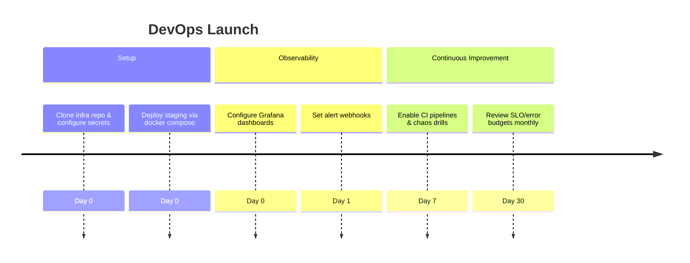

# DevOps Onboarding Audit

## Overview
- **Primary goals:** Deploy environment, monitor uptime, observe job processors.
- **Entry point:** Access to infrastructure repo & monitoring dashboards.
- **Critical path coverage:** account → configure environment variables → deploy backend/frontend → set up observability → monitor job queues.

## Current Experience Snapshot
1. No DevOps persona cues in onboarding overlay; tips lack operational metrics.
2. Planner UI exposes risk flags but not infrastructure health.
3. Repo lacks documented runbooks for FastAPI/Next.js services beyond shell scripts.
4. No mention of CI/CD or infrastructure tests in onboarding experience.

## Friction & Risks
- Delayed ability to monitor uptime leads to unnoticed outages.
- Job processor lag visibility missing; risk of SLA breaches.
- Lacks guidance on configuring Redis, Postgres, or Keycloak.

## Recommendations
| Priority | Recommendation | Expected KPI Lift |
| --- | --- | --- |
| P0 | Add DevOps onboarding checklist (connect to Grafana, set SLOs, deploy Playwright). | Uptime SLO adherence +5pp |
| P0 | Provide infrastructure quickstart (docker compose profiles, env templates). | p95 latency -15% |
| P1 | Surface 5xx per route metrics in Planner alerts for shared visibility. | 5xx per route -20% |
| P1 | Integrate job processor lag widget into dashboards and onboarding tips. | Job processor lag -25% |

## Persona KPI Instrumentation
- **5xx per route:** log reverse proxy metrics to Prometheus.
- **p95 latency:** instrument FastAPI/Node endpoints with OpenTelemetry.
- **Uptime SLO:** connect monitoring to status page & budgets.
- **Job processor lag:** monitor queue depth vs. throughput.

## Proposed Flow (Mermaid)

