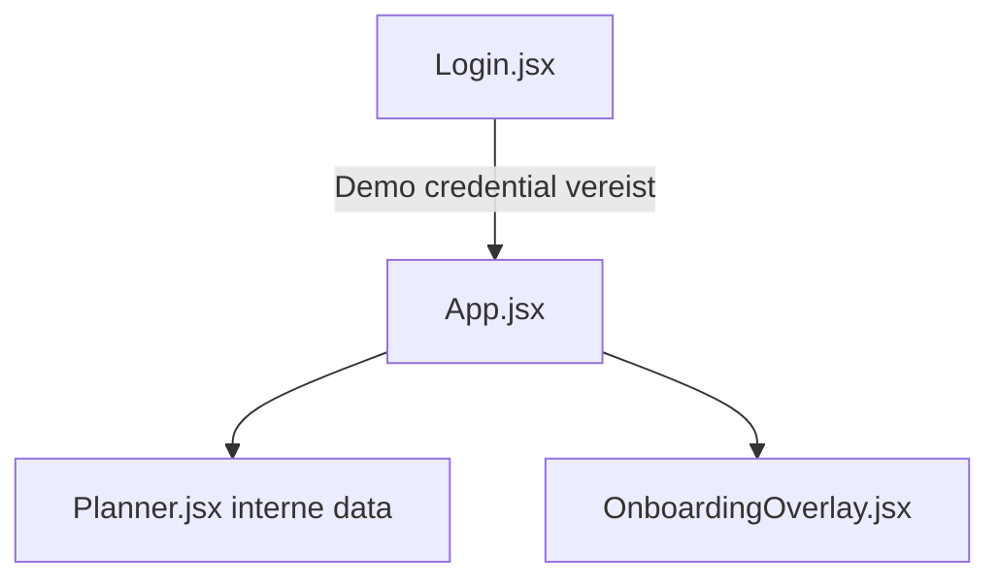

# Onboarding Audit — External Supplier / Partner

**Friction score:** 5 / 5  
**Estimated time-to-value:** Geblokkeerd (geen gasttoegang)

## Flow mapping
| Stap | Component | Opmerking |
| --- | --- | --- |
| Toegang | `<Login>` | Alleen interne demo users, geen uitnodigingsflow of partner portal.【F:Login.jsx†L6-L37】 |
| Autorisatie | `<App>` | Token verplicht; zonder token geen toegang tot overlay of planner.【F:App.jsx†L27-L131】 |
| API | `api.js` | Hardcoded SaaS endpoint, geen partner scope of CORS restricties.【F:api.js†L10-L43】 |
| Onboarding | `<OnboardingOverlay>` | Alle stappen gericht op interne modules; geen gedeelde supply chain acties.【F:OnboardingOverlay.jsx†L6-L173】 |

## Blokkades
1. **Geen invite flow** – Partners kunnen geen account aanmaken of verificatie doorlopen.【F:Login.jsx†L6-L37】
2. **Geen gast-permissies** – Planner verwacht volledige toegang tot interne data.【F:Planner.jsx†L5-L200】
3. **Security risico** – Zelfde API-token als interne gebruikers; geen beperkingen.【F:api.js†L10-L43】

## Fixes & acceptatiecriteria
- Implement guest onboarding stap (email invite, beperkte scopes).
  - *Acceptatie*: Partner ontvangt invite link, ziet beperkte dataset in Planner.【F:App.jsx†L78-L131】
- Voeg supply chain dashboards of deelbare widgets toe.
  - *Acceptatie*: Planner heeft "Partner view" met alleen relevante events + export knop.【F:Planner.jsx†L5-L200】
- Introduceer API scopes en CORS whitelist voor partner domeinen.
  - *Acceptatie*: Partners gebruiken `client_credentials` flow, tokens gelimiteerd.【F:api.js†L14-L43】

## Risico
- **Legal/commercial**: Kritiek – partners kunnen geen status zien.
- **Security**: Hoog – gedeelde tokens vergroten attack surface.

