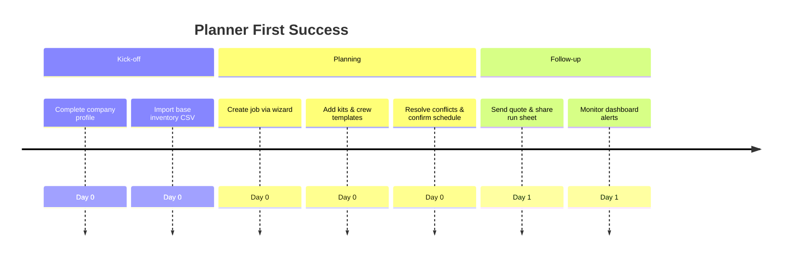

# Planner / Operations Onboarding Audit

## Overview
- **Primary goals:** Build first schedule, align inventory & crew, manage conflicts.
- **Entry point:** Default login persona (Bart/Anna) lands directly in Planner timeline.
- **Critical path coverage:** account → company setup → inventory import → job creation → assign kit & crew → confirm schedule.

## Current Experience Snapshot
1. Planner presets (`anna`, `bart`) exist but hidden in code; no visible UI toggle on first load.
2. Inventory import step is manual; onboarding overlay references generic "booking" step without linking to `/inventory`.
3. Conflict detection relies on `risk` flags, but no interactive resolution from onboarding.
4. Transport scheduling and route hints absent during first job creation.

## Friction & Risks
- Users may skip inventory import leading to double-bookings later.
- Lack of guided crew assignment results in low crew fill rate.
- Planner must context switch between modules manually, risking schedule errors.

## Recommendations
| Priority | Recommendation | Expected KPI Lift |
| --- | --- | --- |
| P0 | Add guided "Start planning" CTA after login that opens job wizard with persona-specific tips. | On-time delivery +10% |
| P0 | Embed CSV import shortcut within onboarding step with progress badges. | Scheduling conflicts -20% |
| P1 | Surface transport checklist (load-out time, route efficiency estimator) before confirmation. | Route efficiency proxy +8% |
| P1 | Introduce crew availability heatmap fed by planner preset filters. | Crew fill rate +12% |

## Persona KPI Instrumentation
- **On-time delivery %:** compare planned vs. actual dispatch times from transport module.
- **Crew fill rate:** track assigned crew vs. required headcount per job.
- **Scheduling conflicts:** monitor overlapping inventory reservations in Prisma.
- **Route efficiency proxy:** combine distance matrix (Mapbox) with job durations.

## Proposed Flow (Mermaid)

