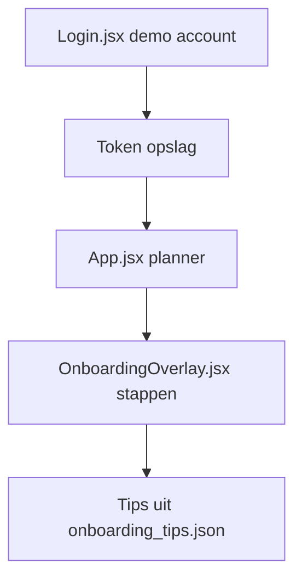

# Onboarding Audit — Sales / Business Development

**Friction score:** 4 / 5  
**Estimated time-to-value:** ~3 dagen (sales pipeline ontbreekt)

## Flow mapping
| Stap | Component | API | Bevinding |
| --- | --- | --- | --- |
| Sign-in | `<Login>` | `/api/v1/auth/login` | Geen sales persona keuze; demo copy verwijst naar operations/finance.【F:Login.jsx†L6-L155】 |
| Dashboard | `<Planner>` | n.b. | Presets focussen op operations (Bart, Anna, etc.), geen Sales pipeline of funnel metrics.【F:Planner.jsx†L5-L101】 |
| Onboarding | `<OnboardingOverlay>` | `/api/v1/onboarding/*` | Geen stap voor CRM-sync of lead import; fallback tips verwijzen naar MR-DJ features (niet sales).【F:onboarding_tips.json†L1-L32】 |

## Blokkades
1. **Geen sales data** – Onboarding bevat geen import of sample leads, dus geen pipeline inzicht.【F:OnboardingOverlay.jsx†L6-L173】
2. **Tips niet relevant** – CTA’s verwijzen naar operations workflows, geen conversie-optimalisatie.【F:onboarding_tips.json†L1-L32】
3. **Geen rol-specifieke copy** – Planner presets noemen andere persona’s, sales weet niet welk filter te gebruiken.【F:Planner.jsx†L5-L101】

## Fixes & acceptatiecriteria
- Voeg sales stap "Sync CRM" toe met API-guided import.
  - *Acceptatie*: Stap toont progress + error state bij mislukte sync.【F:OnboardingOverlay.jsx†L245-L374】
- Maak sales preset met pipeline/funnel widgets en lege-state instructie.
  - *Acceptatie*: Preset bevat statuskolommen "Prospect", "Negotiation", etc.【F:Planner.jsx†L5-L200】
- Update tips JSON met sales CTA’s (demo pitch deck, pipeline export).
  - *Acceptatie*: Tips tonen module `sales` met relevante CTA’s.【F:onboarding_tips.json†L1-L32】

## Risico
- **Revenue impact**: Hoog – geen pipeline → geen forecast.
- **Adoptie**: Middel – Sales team mist guidance, kost extra enablement.

