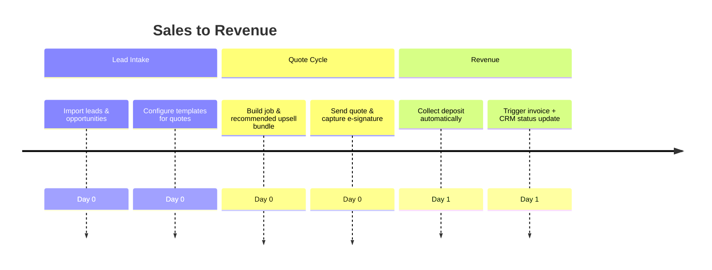

# Sales / Business Development Onboarding Audit

## Overview

- **Primary goals:** Generate quotes, upsell kits, convert leads to contracts.
- **Entry point:** Logs in via demo credentials, sees Planner timeline not optimized for pipeline.
- **Critical path coverage:** account → company setup → CRM import (missing) → create job/event → send quote → contract sign → deposit capture.

## Current Experience Snapshot

1. Login screen highlights demo accounts but lacks CTA for CRM/lead import.
2. Planner view does not show quote stages; sales must infer status from job cards.
3. Onboarding tips omit pricing strategy, upsell suggestions, or discount guardrails.
4. No integration path for Stripe deposit capture triggered from quote acceptance.

## Friction & Risks

- Sales lacks context on conversion funnel; hard to track quote-to-book.
- Manual entry for upsell items reduces attach rate.
- Discounting guardrails absent, risking margin erosion.

## Recommendations

| Priority | Recommendation                                                                  | Expected KPI Lift         |
| -------- | ------------------------------------------------------------------------------- | ------------------------- |
| P0       | Add sales-focused onboarding step linking to quote builder with suggested kits. | Quote-to-book +14%        |
| P0       | Introduce pricing playbook tip cards referencing average discount thresholds.   | Avg. discount -5pp        |
| P1       | Provide CRM import wizard (CSV + API) in onboarding overlay.                    | Upsell attach rate +8%    |
| P1       | Automate deposit capture trigger on quote acceptance, surfaced in onboarding.   | Deposit capture rate +10% |

## Status Update — 24 oktober 2025

- De nieuwe **CRM import wizard** biedt een live pipeline-overzicht, validatiestappen en CTA’s naar opvolgflows zodat accountmanagers direct met gesynchroniseerde data werken.【F:src/pages/sales/SalesCRMImport.tsx†L1-L210】
- Het **pricing playbook** bundelt nu drie MR-DJ kits met discount guardrails en KPI’s, rechtstreeks gevoed door de finance store, waardoor sales consistente marges kan bewaken.【F:src/pages/sales/SalesOfferPlaybook.tsx†L1-L200】
- De **sales → operations hand-off** checklist monitort automation runs, deposit capture en CRM-terugkoppeling zodat het team weet wanneer het echt 100% sales ready is.【F:src/pages/sales/SalesHandoffPlaybook.tsx†L1-L210】

## Persona KPI Instrumentation

- **Quote-to-book %:** track accepted quotes vs. total sent.
- **Average discount:** compute discount amount vs. list price per quote.
- **Upsell attach rate:** measure optional kit add-ons accepted per job.

## Proposed Flow (Mermaid)

