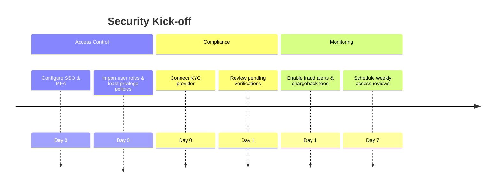

# Security & KYC Onboarding Audit

## Overview
- **Primary goals:** Validate customer identities, monitor fraud, enforce least privilege.
- **Entry point:** Admin invite to security dashboard (missing) or API configuration.
- **Critical path coverage:** account → company setup → enable KYC provider → review flags → approve/deny bookings.

## Current Experience Snapshot
1. No dedicated security module or persona preset; onboarding overlay lacks security copy.
2. Login flow has default credentials and no MFA enforcement.
3. API calls lack mention of audit logging or KYC integration points.
4. Planner risk flags unrelated to compliance; no fraud or chargeback indicators.

## Friction & Risks
- High risk of unauthorized access due to shared demo credentials.
- No ability to track chargebacks or KYC pass rates.
- Security teams lack observability into job approvals or changes.

## Recommendations
| Priority | Recommendation | Expected KPI Lift |
| --- | --- | --- |
| P0 | Enforce role-based invites with MFA and audit logging on login events. | Fraud-flag rate -20% |
| P0 | Add security onboarding checklist with steps for KYC provider setup & review queue. | KYC pass rate +15% |
| P1 | Surface chargeback alerts and fraud scores in Planner risk feed. | Chargeback rate -12% |
| P1 | Provide access review cadence & notifications inside onboarding tips. | Unauthorized access incidents -30% |

## Persona KPI Instrumentation
- **KYC pass rate:** integrate provider webhooks to track approved applicants vs. total.
- **Fraud-flag rate:** count bookings flagged by risk rules.
- **Chargeback rate:** ingest payment gateway dispute data.

## Proposed Flow (Mermaid)

