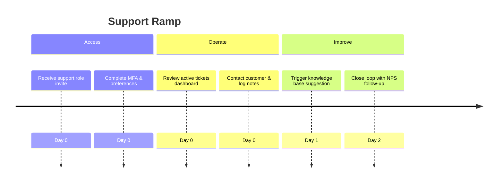

# Support Onboarding Audit

## Overview
- **Primary goals:** Resolve tickets fast, monitor SLA breaches, understand client context.
- **Entry point:** Likely enters via Planner or dedicated support module (missing) after invite.
- **Critical path coverage:** account → company setup → access support queue → link to jobs/inventory → update customer.

## Current Experience Snapshot
1. No support persona preset; onboarding overlay lacks references to ticketing or SLA.
2. Planner cards do not expose NPS or SLA metadata; support must manually search for jobs.
3. No integration with communication channels (email/phone) from onboarding steps.
4. Error handling in UI (e.g., login errors) lacks structured troubleshooting guidance.

## Friction & Risks
- Support agents have no dedicated workspace; risk of slow first-contact resolution.
- SLA tracking absent; can't proactively manage escalations.
- Customer communication history not surfaced, leading to inconsistent answers.

## Recommendations
| Priority | Recommendation | Expected KPI Lift |
| --- | --- | --- |
| P0 | Introduce support persona toggle with filtered view of active issues & overdue jobs. | Ticket SLA compliance +15% |
| P0 | Add onboarding tip linking to support playbook and escalation matrix. | First-contact resolution +12% |
| P1 | Integrate NPS survey ingestion and display alerts in onboarding overlay. | NPS +6 pts |
| P1 | Provide canned response templates accessible from onboarding resources. | Response time -20% |

## Persona KPI Instrumentation
- **Ticket SLA %:** track ticket open/close timestamps vs. SLA thresholds.
- **NPS:** ingest survey data, tie to job IDs.
- **First-contact resolution %:** mark tickets resolved without re-open events.

## Proposed Flow (Mermaid)

