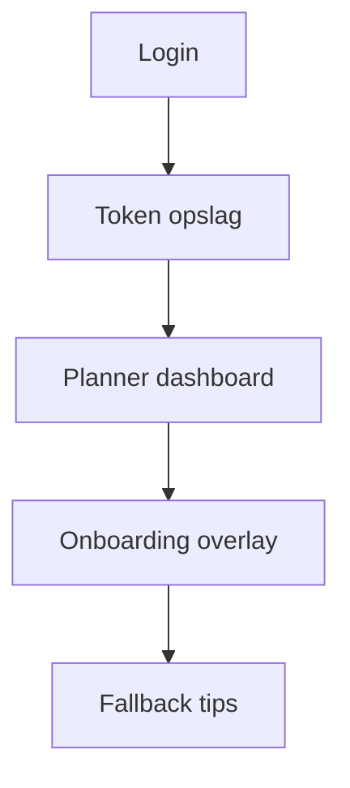

# Onboarding Audit — Support Agent

**Friction score:** 4 / 5  
**Estimated time-to-value:** 3 dagen (geen ticketing integratie)

## Flow mapping
| Stap | Component | API | Bevinding |
| --- | --- | --- | --- |
| Aanmelding | `<Login>` | `/api/v1/auth/login` | Geen support rol of knowledge base verwijzing; enkel algemene copy.【F:Login.jsx†L6-L155】 |
| Dashboard | `<Planner>` | n.b. | Geen support queue/SLA widgets of alerts.【F:Planner.jsx†L5-L200】 |
| Onboarding | `<OnboardingOverlay>` | `/api/v1/onboarding/*` | Geen support tickets stap; error states tonen generieke fallback tekst.【F:OnboardingOverlay.jsx†L149-L237】 |

## Blokkades
1. **Geen ticketing integratie** – Onboarding heeft geen link naar helpdesk/incident flows.【F:OnboardingOverlay.jsx†L6-L173】
2. **Errors verborgen** – Support kan API-falen niet zien omdat UI fallback toont.【F:OnboardingOverlay.jsx†L149-L173】
3. **Geen empty state** – Planner toont niets wanneer geen events; support weet niet waar tickets staan.【F:Planner.jsx†L5-L200】

## Fixes & acceptatiecriteria
- Voeg support stap "Koppel ticketing" met progress & error surface toe.
  - *Acceptatie*: Stap toont instructies + link naar SLA definities.【F:OnboardingOverlay.jsx†L245-L374】
- Toon API foutmeldingen en retry CTA.
  - *Acceptatie*: Bij 5xx toont overlay duidelijke foutbalk en log ID.【F:OnboardingOverlay.jsx†L201-L237】
- Maak support preset (open tickets, SLA breaches) met lege-state copy.
  - *Acceptatie*: Preset heeft tabel + call-to-action om tickets te importeren.【F:Planner.jsx†L5-L200】

## Risico
- **Customer satisfaction**: Hoog – geen support workflows.
- **Operational**: Middel – support agents missen alerts.

