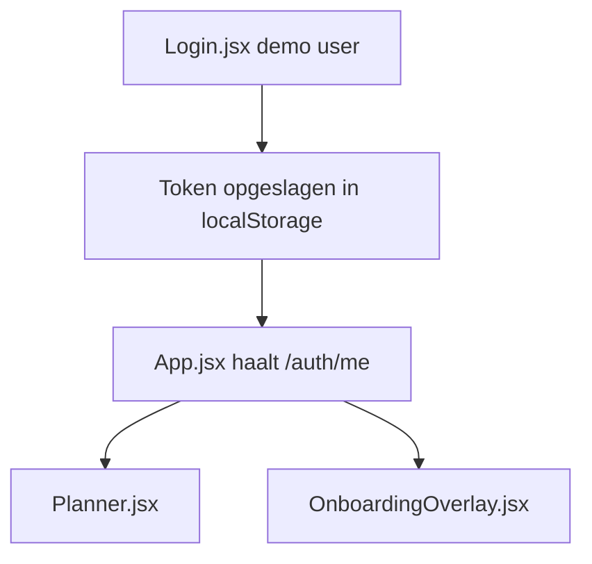

# Onboarding Audit — System Admin

**Friction score:** 4 / 5  
**Estimated time-to-value:** 2-3 dagen (handmatig configureren van omgevingen)

## Flow mapping
| Stap | Component | API | Bevinding |
| --- | --- | --- | --- |
| Authenticatie | `<Login>` | `/api/v1/auth/login` | Geen SSO/Keycloak; enkel demo credentials, geen roltoewijzing.【F:Login.jsx†L6-L137】 |
| Tokenbeheer | `api.js` | n.v.t. | Base URL hardcoded naar productie; tokens opgeslagen in localStorage zonder refresh logic.【F:api.js†L10-L43】 |
| Sessievalidatie | `<App>` | `/api/v1/auth/me` | Fallback op lokaal opgeslagen e-mail; geen foutmelding in UI.【F:App.jsx†L32-L46】 |
| Onboarding | `<OnboardingOverlay>` | `/api/v1/onboarding/*` | Geen stappen voor sleutelbeheer, environment setup of health checks.【F:OnboardingOverlay.jsx†L6-L173】 |

## Blokkades
1. **Geen environment configuratie** – hardcoded API endpoint maakt staging/tests onmogelijk.【F:api.js†L10-L19】
2. **Geen rolbeheer** – System admin kan geen gebruikers uitnodigen of rollen toekennen.【F:Login.jsx†L6-L37】【F:App.jsx†L94-L116】
3. **Geen monitoring** – Onboarding bevat geen health check of logging stap.【F:OnboardingOverlay.jsx†L6-L173】

## Fixes & acceptatiecriteria
- **Introduceer `.env` configuratie** voor `VITE_API_BASE_URL` en fallback naar veilige default.
  - *Acceptatie*: Dev kan `.env.local` instellen en UI toont juiste endpoint indicator.【F:api.js†L10-L43】
- **Voeg systeembeheer stap toe** (SSO-config, audit logs) met status check.
  - *Acceptatie*: Checklist blokkeert afronding tot SSO callback getest.【F:OnboardingOverlay.jsx†L245-L374】
- **UI voor rolbeheer** binnen Planner of apart scherm.
  - *Acceptatie*: System admin kan gebruiker uitnodigen, role mapping zichtbaar.【F:App.jsx†L78-L129】

## Risico
- **Security**: Hoog – productie endpoint gedeeld in publiek repo.
- **Ops**: Middel – geen health checks of logging.

