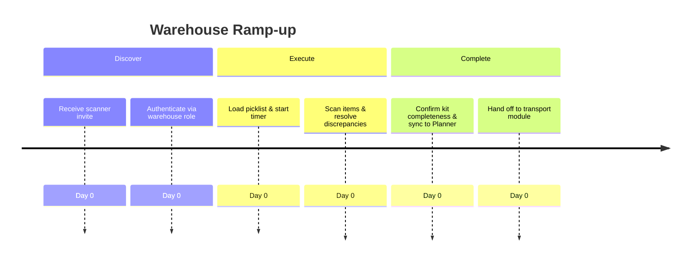

# Warehouse Technician Onboarding Audit

## Overview
- **Primary goals:** Prepare kits, scan inventory, validate completeness before dispatch.
- **Entry point:** Likely mobile scanner PWA or Planner quick link.
- **Critical path coverage:** account → inventory import → kit templates → pick/scan → confirm schedule → transport handoff.

## Current Experience Snapshot
1. No direct navigation from onboarding overlay to scanner module (`Scanner` entry toggled by env flag only).
2. Warehouse KPIs absent; tips focus on generic AI messaging rather than pick accuracy.
3. No mention of staging, barcode validation, or discrepancy handling in onboarding steps.
4. Planner timeline cards mix warehouse tasks with sales context, causing overload.

## Friction & Risks
- Technicians cannot discover scanner mode; scanning accuracy suffers.
- Lack of kit completeness prompts increases prep time per order.
- No offline/low-connectivity guidance for warehouse floor usage.

## Recommendations
| Priority | Recommendation | Expected KPI Lift |
| --- | --- | --- |
| P0 | Add "Open Scanner" CTA and QR code instructions in onboarding step `scan`. | Scan throughput +18% |
| P0 | Provide discrepancy resolution checklist (missing items, substitutes) with quick actions. | Kit completeness +15% |
| P1 | Surface prep timer and SLA targets on Planner cards for warehouse tasks. | Prep time/order -12% |
| P1 | Enable offline cache & sync status indicator in scanner onboarding. | Pick accuracy +10% |

## Persona KPI Instrumentation
- **Pick accuracy %:** compare scanned vs. expected quantities in job manifest.
- **Prep time/order:** capture timestamps from pick start to completion events.
- **Kit completeness %:** log discrepancies resolved before dispatch.
- **Scan throughput:** scans per minute aggregated per shift.

## Proposed Flow (Mermaid)

